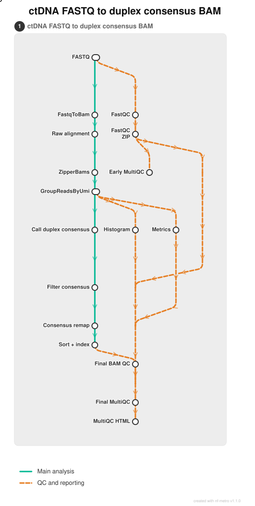

# FASTQ to duplex-consensus BAM workflow

This folder contains the FASTQ-processing part of odctDNA Nextflow pipeline. The workflow starts from paired-end FASTQ files containing UMIs and produces mapped, sorted and indexed duplex-consensus BAM files for downstream analysis.



**Figure 1. Overview of the FASTQ-to-duplex-consensus workflow.** Green shows the main processing steps, while orange shows the QC and reporting steps.

## Worflow steps

For each R1/R2 FASTQ pair, the workflow:

1. runs FastQC on the raw reads;
2. extracts the UMIs and creates an unmapped BAM with fgbio;
3. aligns the reads to the reference genome with BWA-MEM2;
4. groups reads belonging to the same original molecule;
5. builds and filters duplex-consensus reads;
6. remaps the consensus reads and creates the final BAM and BAI files; and
7. collects FastQC, fgbio, samtools and Picard results in MultiQC reports.

The QC steps are kept in a separate subworkflow, `subworkflows/local/ctdna_fastq_to_dx_qc/main.nf`, but they are called directly by the main workflow. MultiQC combines the QC reports; it does not merge FASTQ reads.

A separate branch also creates a deduplicated pre-consensus BAM for fragmentomics. 

## Inputs

The workflow needs:

- a tab-separated sample sheet containing the paired FASTQ paths;
- a reference FASTA, its `.fai` index and sequence dictionary;
- the matching BWA-MEM2 index;
- the panel, bait and target interval lists; and
- a GATK/samtools Conda environment when using the Conda profile.

The sample sheet must contain these columns:

```text
sample	patient	endpoint	fastq_1	fastq_2
```

An example is provided in `examples/fastq_samplesheet.example.tsv`. Each row represents one FASTQ pair or sequencing lane and must have a unique sample ID. The workflow does not merge lanes.

The FASTQ filenames are expected to end in `_R1.fastq.gz` and `_R2.fastq.gz`, following the pattern in the example sample sheet.

## Running the workflow

The workflow requires Linux, Java and Nextflow 25.10.4 or later.

First, copy and edit the example files:

```bash
cp examples/fastq_samplesheet.example.tsv samplesheet.local.tsv
cp examples/params.example.json params.local.json
```

Replace the example FASTQ, reference and interval paths with the paths available on the system where the workflow will run. Then launch it from this directory:

```bash
nextflow -C nextflow.config run main.nf \
    -profile conda \
    -params-file params.local.json
```

For the Conda profile, `dedup_conda_env` in the parameter file must point to an environment containing GATK and samtools. If all programs are already installed, `-profile native` can be used instead. Add `-resume` to continue an interrupted run.

## Main outputs

By default, results are written to `results/`.

| Output | Folder |
| --- | --- |
| Final duplex-consensus BAM and BAI | `results/ctdna_fastq_to_dx/consensus_mapped/` |
| Complete MultiQC report | `results/ctdna_fastq_to_dx/qc/multiqc_complete/` |
| FastQC and early MultiQC reports | `results/ctdna_fastq_to_dx/qc/` |
| UMI and duplex metrics | `results/ctdna_fastq_to_dx/grouped/` and `results/ctdna_fastq_to_dx/metrics/` |
| Deduplicated pre-consensus BAM | `results/dedup_mapped/` |
| Nextflow execution reports | `results/pipeline_info/` |

The main result for each sample is `<sample>_dx_mapped.bam` together with its BAM index.

## Code version

This supplementary copy is based on the `FINAL_CLEAN` branch of `m-fuentesguirado/ctdna-multicaller-nextflow`, commit `6dba9e414e2f70f069f82b9fa58e69298bfbb14d` (27 August 2026).

Sequencing data, patient sample sheets and reference files are not included. Information about the copied nf-core modules is provided in `THIRD_PARTY_NOTICES.md` and `LICENSES/`.
